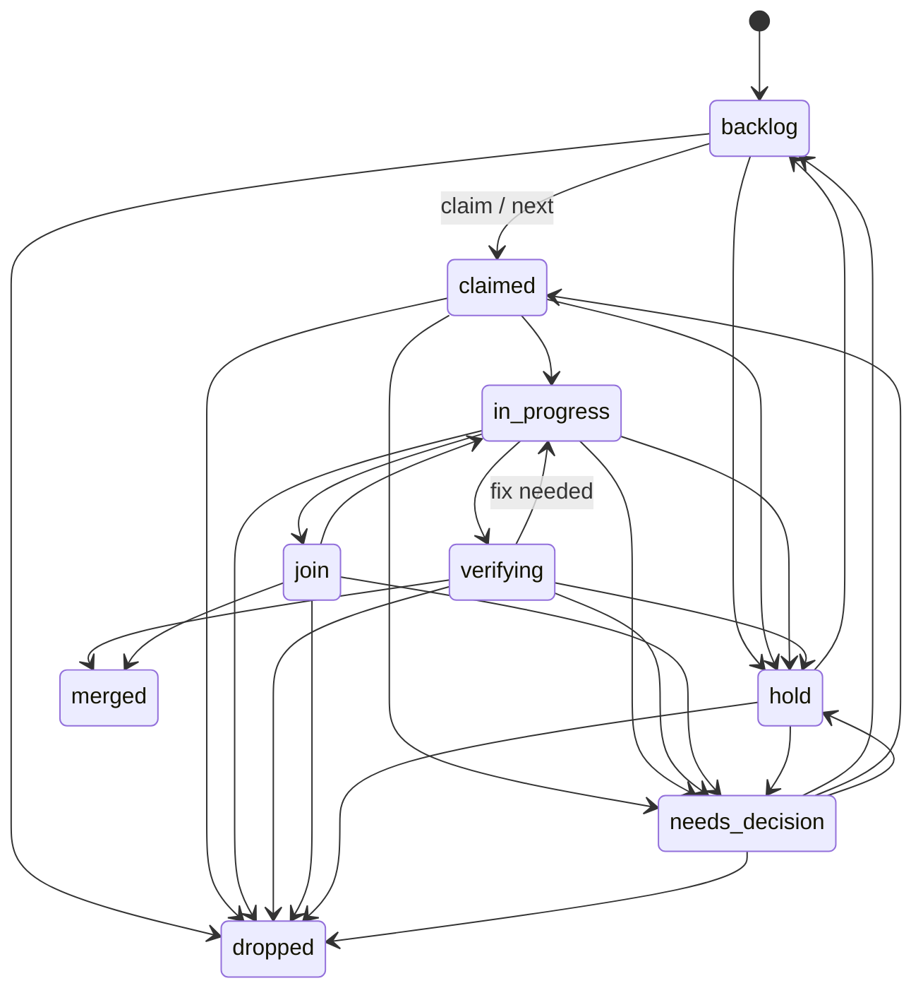

# handoffkeep
A durable home for coding-agent handoffs, working memory, and documents across sessions and machines.

## Tasks

`tasks` is the durable, Postgres-backed work queue for captains. A task belongs
to a lane; `parent_lane` lets a parent captain list pending decisions from its
child lanes. Creation starts in `backlog`. Claiming and `next` are atomic, so
only one session can claim an item. Every state change, including a claim, is
recorded in `task_events`.

```bash
handoffkeep tasks add --lane captain --title "add queue endpoint" --kind implement --priority 10
handoffkeep tasks list --lane captain --state backlog
handoffkeep tasks next --lane captain --by captain-session  # exits 3 when empty
handoffkeep tasks transition 42 --to in_progress --note "started"
handoffkeep tasks transition 42 --to needs_decision --question "Which interface should own this?"
handoffkeep tasks list --parent-lane captain --state needs_decision
handoffkeep tasks show 42
```

`add` accepts `--parent-lane`, `--pr`, `--head-sha`, `--report-path`, and
`--job-id` as durable references. `transition` accepts the same reference flags.
`needs_decision` always requires `--question`.



The HTTP API uses the usual bearer token: `POST /v1/tasks`, `GET /v1/tasks`,
`GET /v1/tasks/{id}`, `POST /v1/tasks/{id}/claim`, and
`POST /v1/tasks/{id}/transition`. `POST /v1/tasks/next` supports the CLI's
atomic `next` operation. Invalid state changes and competing claims return 409.

## Relay events

Relay events persist worker completion, escalation, and join reports before a
hub delivers them to an owner lane. Clients use `POST /v1/relay/events` to
append an event, `POST /v1/relay/events/{id}/delivered` with
`{"machine":"host-a","pane":"w1:p1"}` to record delivery, and
`GET /v1/relay/events?undelivered=1&lane=lane-a` to find work still awaiting
delivery. Omitting `lane` lists every lane; `undelivered=1` (or `true`) is for
recovery workers that must only retry events without a recorded delivery.

The idempotency key is `(kind, job_id, epoch, report_path, reason)`. A first
append returns 201; a duplicate returns 200 with the same event ID. `attempts`
starts at zero and increases once for every duplicate receipt, so it measures
duplicate receive attempts rather than successful deliveries.

## Attachments (R2)

Attachments are immutable, content-addressed private R2 objects. Configure all
four S3 settings to enable them: `HK_S3_ENDPOINT`, `HK_S3_BUCKET`,
`HK_S3_ACCESS_KEY_ID`, and `HK_S3_SECRET_ACCESS_KEY`. R2 uses region `auto`
and path-style requests. When any setting is absent, only attachments are
disabled; checkpoints, memory, and documents continue to work.

The default safety limits are a 50 MiB object maximum, 8 GiB total storage,
800,000 monthly writes, and 8,000,000 monthly reads. Set the corresponding
`HK_ATTACH_*` variables to positive values to adjust them. Text attachments
are secret-scanned, MIME is sniffed and allowlisted, and dump/archive filename
extensions are rejected. Objects are never made public.

```bash
handoffkeep attach put image.png --checkpoint 42
handoffkeep attach get SHA256 -o image.png
handoffkeep attach list --doc jobs/example/brief.md
handoffkeep attach usage
handoffkeep r2usage --alert
```

HTTP clients use raw `PUT /v1/attachments` with `X-HK-Name`, `Content-Type`,
and optional `X-HK-Ref` (`checkpoint:<id>`, `document:<key>`, or
`memory:<agent>/<name>`). `GET /v1/attachments/{sha}` streams through the
service; add `?presign=1` for a ten-minute private URL. `/v1/usage` and
authenticated `/metrics` expose the local fuse counters. `r2usage` is optional
and safely reports `skipped` when Cloudflare analytics credentials are absent.
