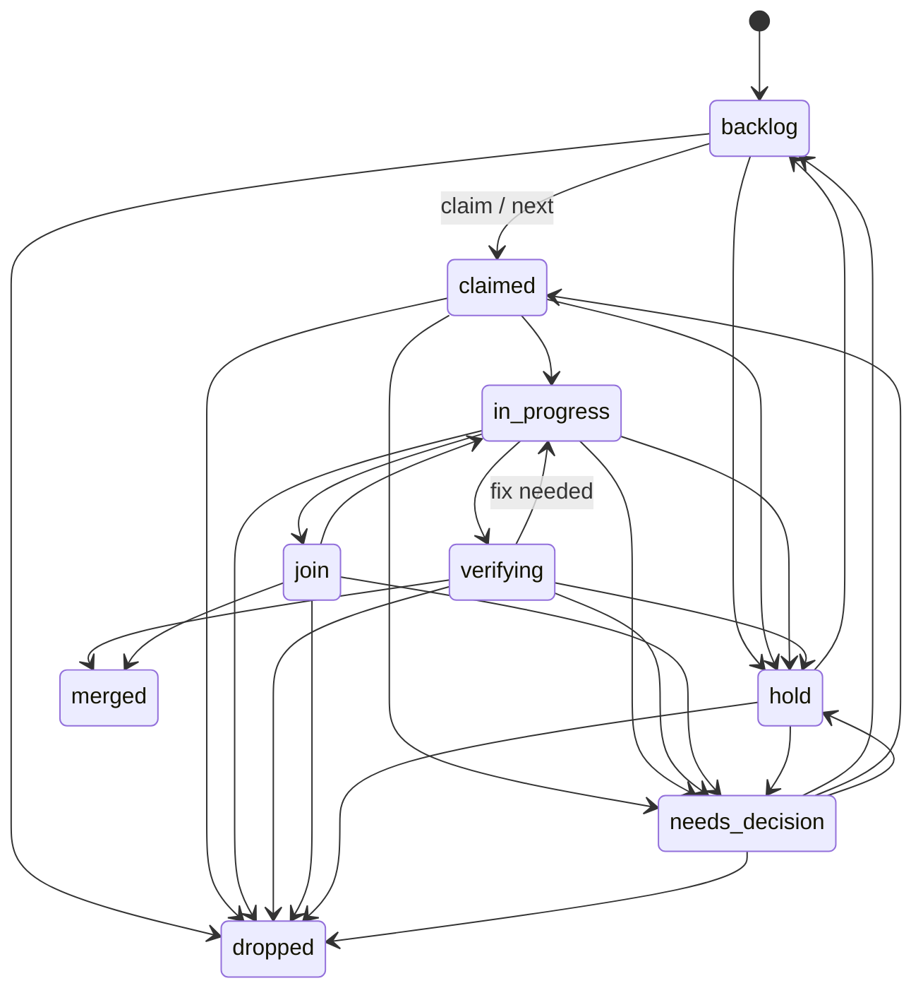

# handoffkeep
A durable home for coding-agent handoffs, working memory, and documents across sessions and machines.

## Fleet console (/ui)

The optional fleet console renders relay timelines, task queues, unresolved
decisions, session checkpoints, and hub status. Authenticated operators can
answer decision items individually or in batches, compose lane events, and
close externally answered decisions with `handoffkeep decisions resolve`. It
is mounted only when the Cloudflare Access configuration is
complete and uses a separate Access assertion from the API bearer token. See
[docs/ui.md](docs/ui.md) for configuration, security boundaries, hub behavior,
and the SSE contract.

## Tasks

`tasks` is the durable, Postgres-backed work queue for captains. A task belongs
to a lane; `parent_lane` lets a parent captain list pending decisions from its
child lanes. Creation starts in `backlog`. Claiming and `next` are atomic, so
only one session can claim an item. Every state change, including a claim, is
recorded in `task_events`.

```bash
handoffkeep tasks add --lane lane-a --title "add queue endpoint" --kind implement --priority 10
handoffkeep tasks list --lane lane-a --state backlog
handoffkeep tasks next --lane lane-a --by session-a  # exits 3 when empty
handoffkeep tasks transition 42 --to in_progress --note "started"
handoffkeep tasks transition 42 --to needs_decision --question "Which interface should own this?"
handoffkeep tasks list --parent-lane lane-a --state needs_decision
handoffkeep tasks show 42
handoffkeep tasks export [--lane L --state S --parent-lane P --limit N]
```

`add` accepts `--parent-lane`, `--pr`, `--head-sha`, `--report-path`, and
`--job-id` as durable references. `transition` accepts the same reference flags.
`needs_decision` always requires `--question`. `add` also accepts the typed
origin relations `--origin-pr <merged PR URL>` and `--origin-task <id>`
(`refs.origin_pr` / `refs.origin_task`, "this row came from"; `closing_pr` is
reserved for #494).

### Disposition items (merge → operator)

A disposition item is a `kind=decide` task whose `refs.disposition` records one
source (exactly one of `origin_pr` or `origin_task`), facts copied from tools
(merge SHA and time from `gh pr view --json url,state,mergeCommit,mergedAt`,
install state with a witness doc or `unknown`, residual count from a list), a
closed choice set (A 배포 · B 후속 발주 · C 잔여 수용 · D 보류 · E 조치 없음)
and one recommendation. It is created directly in `needs_decision` inside one
transaction, so it is never claimable; at most one item per source is open.

```bash
gh pr view <url> --json url,state,mergeCommit,mergedAt > pr.json
handoffkeep tasks disposition add --lane director-1 --origin-pr <url> --gh-json pr.json \
  --residuals residuals.json --recommended C [--install-state unknown]
handoffkeep tasks disposition summary [--as-of RFC3339] [--json]
handoffkeep tasks disposition apply <id> [--note text]
```

Only the operator's Access-authenticated web route answers an item
(`/ui/dispositions/answer`, `/ui/dispositions/accept-batch`); generic
transitions, `decisions resolve`, and compose are refused with
`disposition_operator_only`. Silence changes nothing: no code path answers,
demotes, or claims an open item. `apply` records the director's application of
the operator's answer with legal edges only (A/B/C → `merged`, D → `hold`,
E → `dropped`); an item never returns to `backlog`. An "A 배포" answer is
consent to order a deploy; deploy windows and the installer procedure are
unchanged. `summary` is the one definition of the digest header
(`미처분 n · 최고령 x일`, plus `다음 묶음 m건` beyond 50) and is replayed
from `task_events`, so `--as-of` reproduces a past header. Bearer routes:
`POST /v1/tasks/dispositions`, `GET /v1/tasks/dispositions/summary`,
`POST /v1/tasks/dispositions/{id}/apply`.



The HTTP API uses the usual bearer token: `POST /v1/tasks`, `GET /v1/tasks`,
`GET /v1/tasks/{id}`, `POST /v1/tasks/{id}/claim`, and
`POST /v1/tasks/{id}/transition`. `POST /v1/tasks/next` supports the CLI's
atomic `next` operation. Invalid state changes and competing claims return 409.
`GET /v1/tasks/export` returns one consistent snapshot of the queue — a
single bounded JSON document carrying the snapshot ID, watermarks, filtered
counts, integrity digests, and the task rows — read inside one repeatable-read
read-only transaction. `handoffkeep tasks export` prints the document
unchanged; see docs/contract.md for the full envelope and digest contract.

### Optional hk → Linear synchronization

`serve --linear-sync` is off by default. The `handoffkeep-work(:8801)`
instance must not be given `--linear-sync`; only the explicitly designated
serving instance may drain the connector outbox. Enabling it requires
`HK_LINEAR_API_KEY` and `HK_LINEAR_TEAM_ID`; `HK_LINEAR_API_URL` is optional
and exists so tests can inject a local fake server. API keys are not accepted
through CLI flags.

Individual builder tasks opt in independently with `tasks add --linear-sync`.
The task flags `--tier`, `--grade`, `--brief-key`, and repeatable `--label`
populate explicit `refs.linear` metadata; task titles and lane names are never
used to infer eligibility. A task without `refs.linear.sync: true` creates no
Linear outbox work even on a sync-enabled server. Requested labels must already
exist in Linear; missing labels are reported and are never created.

Delivery is at-least-once with marker-based duplicate suppression, not external
exactly-once delivery. Before retrying after an ambiguous response loss, the
connector searches for the task/comment marker or reads the issue's current
state. A residual duplicate window remains when Linear accepted a request but
the response was lost and its newly written marker is not yet visible to the
next search because of indexing delay. Terminal tasks receive a marker-bearing
comment and are archived; the connector has no delete operation. Use
`handoffkeep linear reconcile --dry-run` for read-only drift inspection. Without
`--dry-run`, the command writes the generated handoffkeep drift report. Use
`GET /v1/linear/status` to see pending/failed outbox work and its latest error.

## Relay events

Relay events persist worker completion, escalation, and join reports before a
hub delivers them to an owner lane. Clients use `POST /v1/relay/events` to
append an event, `POST /v1/relay/events/{id}/delivered` with
`{"machine":"host-a","pane":"w1:p1"}` to record delivery, and
`GET /v1/relay/events?undelivered=1&lane=lane-a` to find work still awaiting
delivery. Omitting `lane` lists every lane; `undelivered=1` (or `true`) is for
recovery workers that must only retry events without a recorded delivery. The
additive `kind` parameter selects one supported kind, and `after_id` is an
exclusive durable-ID cursor; use the last returned ID as the next `after_id` to
advance through a recovery backlog without repeating an earlier page.

For `job.completed`, `job.escalate`, and `job.joined`, the idempotency key is
`(kind, job_id, epoch, report_path, reason)`. A first append returns 201; a
duplicate returns 200 with the same event ID. `attempts` starts at zero and
increases once for every duplicate receipt, so it measures duplicate receive
attempts rather than successful deliveries.

`lane.event` is a directly addressed, durable lane notification. Its required
fields are `kind: "lane.event"`, `owner_lane`, `event_id`, and `text`; its
idempotency key is `(owner_lane, event_id)`. `owner_lane` is the destination
lane, not a parent-routing hint. `text` must be nonempty, at most 2048 bytes,
and contain no NUL or C0/C1 control characters (including tab, CR, and LF).
Job event kinds reject a nonempty `event_id` or `text`; this makes the two
idempotency families unambiguous. As with job events, duplicate lane-event
posts return the first writer's original row, increment `attempts`, and never
change `delivered_at`.

## Operator chat

Desk sessions post durable questions and the operator answers them in a
browser. This service owns only the persistence layer; the chat screen lives
elsewhere. `PUT /v1/chat/questions/{id}` (or `POST /v1/chat/questions` with
the id in the body) upserts by the producer's
`Q-YYYYMMDD-NN` id — a repeat id updates the row instead of adding one. A
question is `pending` until `POST /v1/chat/questions/{id}/transition` moves it
to `resolved` (which stamps `resolved_at`) or `withdrawn`.
`GET /v1/chat/questions?lane=&state=&after_id=&limit=` pages by id cursor.
`POST /v1/chat/messages` stores an `operator` (or `desk`) message with
`relay_state='stored'`; `POST /v1/chat/messages/{id}/delivered` records
successful relay and stamps `delivered_at`, while `/{id}/failed` marks a relay
failure. `GET /v1/chat/messages?author=&undelivered=1&after_id=&limit=` pages
in insertion order. A built-in daily retention job deletes terminal-state
chat rows older than one year (`resolved`/`withdrawn` questions, `delivered`
messages) — `pending` questions and `stored`/`failed` messages are preserved
regardless of age — bounded to at most 1000 rows per table per run.

## Attachments (R2)

Attachments are immutable, content-addressed private R2 objects. Configure all
four S3 settings to enable them: `HK_S3_ENDPOINT`, `HK_S3_BUCKET`,
`HK_S3_ACCESS_KEY_ID`, and `HK_S3_SECRET_ACCESS_KEY`. R2 uses region `auto`
and path-style requests. When any setting is absent, only attachments are
disabled; checkpoints, memory, and documents continue to work.

The default safety limits are a 50 MiB object maximum, 8 GiB total storage,
800,000 monthly writes, and 8,000,000 monthly reads. Set the corresponding
`HK_ATTACH_*` variables to positive values to adjust them. Text attachments
are secret-scanned, MIME is sniffed and allowlisted, and dump/archive filename
extensions are rejected. Objects are never made public.

```bash
handoffkeep attach put image.png --checkpoint 42
handoffkeep attach get SHA256 -o image.png
handoffkeep attach list --doc jobs/example/brief.md
handoffkeep attach usage
handoffkeep r2usage --alert
```

HTTP clients use raw `PUT /v1/attachments` with `X-HK-Name`, `Content-Type`,
and optional `X-HK-Ref` (`checkpoint:<id>`, `document:<key>`, or
`memory:<agent>/<name>`). `GET /v1/attachments/{sha}` streams through the
service; add `?presign=1` for a ten-minute private URL. `/v1/usage` and
authenticated `/metrics` expose the local fuse counters. `r2usage` is optional
and safely reports `skipped` when Cloudflare analytics credentials are absent.

## Container image

CI builds `ghcr.io/mgh3326/handoffkeep` — a single static binary on distroless,
running as nonroot — on every PR, and pushes it (tags: full commit SHA and
`main`) on each `main` push. Image contents, tag rules, the `vcs.revision`
verification command, and the environment-variable name list live in
[docs/image.md](docs/image.md). This pipeline produces the image only; the
deployment path is unchanged.
